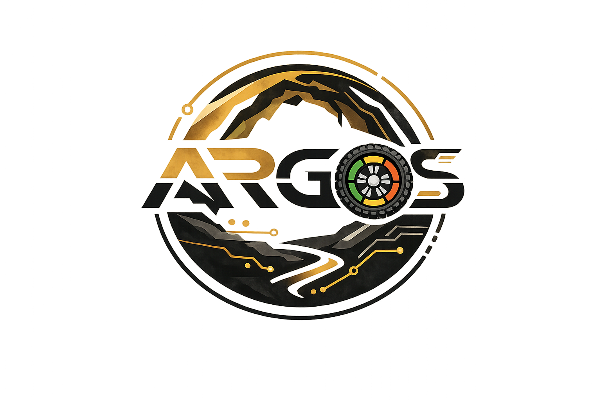

<div align="center">
  
</div>

<h1 align="center">ARGOS</h1>
<h3 align="center">Sistema de Reconocimiento y Seguridad en Cuevas</h3>

<div align="center">


</div>

---

**ARGOS** es un robot autónomo para monitoreo ambiental y seguridad en operaciones de exploración de cuevas.
Integra hardware embebido, firmware de comunicaciones LoRa y software en Python para medir el entorno subterráneo, mapear el espacio con LiDAR, detectar riesgos y transmitir telemetría en tiempo real hacia una estación base.

> Proyecto educativo y de investigación del equipo **CALIBOTS KAIROS** — desarrollado con disciplina de ingeniería y evidencia real.

---

## Tabla de contenidos

1. [Contexto y problema](#1-contexto-y-problema)
2. [Protocolo operativo](#2-protocolo-operativo)
3. [Objetivos](#3-objetivos)
4. [Electrónica y sensores](#4-electrónica-y-sensores)
5. [Arquitectura del sistema](#5-arquitectura-del-sistema)
6. [Estructura del repositorio](#6-estructura-del-repositorio)
7. [Instalación](#7-instalación)
8. [Ejecución](#8-ejecución)
9. [Interfaz web (Lovable-UI)](#9-interfaz-web-lovable-ui)
10. [Roadmap](#10-roadmap)
11. [Contribución](#11-contribución)
12. [Seguridad](#12-seguridad)
13. [Créditos y licencia](#13-créditos-y-licencia)

---

## 1. Contexto y problema

La exploración de cuevas expone a las personas a riesgos serios: **baja visibilidad**, **variación de calidad del aire** (CO₂, gases), **temperatura extrema**, **obstáculos y geometrías desconocidas**. Las decisiones se toman con información limitada.

ARGOS busca solucionar eso con un **prototipo autónomo** que:

- mide el entorno antes de que entre una persona,
- transmite datos en tiempo real a la superficie,
- registra evidencia (video, logs, mapa 2D/3D),
- emite alertas si se detecta riesgo.

El sistema **no reemplaza protocolos profesionales de rescate ni certificaciones de seguridad**. Es un prototipo educativo orientado a demostrar la aplicación de tecnología en seguridad operativa.

---

## 2. Protocolo operativo

ARGOS sigue un ciclo de tres fases:

```
ANTES               DURANTE             DESPUÉS
─────────────────   ─────────────────   ─────────────────
Configurar misión   Monitorear ambiente  Analizar registros
Verificar hardware  Detectar riesgos    Revisar evidencia
Cargar umbrales     Transmitir datos    Generar reporte
                    Alertar si riesgo   Actualizar bitácora
```

Esta lógica guía toda la arquitectura: los módulos de `sensors/`, `decision/` y `comms/` corresponden directamente a las tres fases.

---

## 3. Objetivos

### Objetivo general

Diseñar, implementar y validar **ARGOS**: un sistema robótico capaz de monitorear parámetros ambientales en cuevas, procesar la información localmente y transmitir telemetría a larga distancia para su visualización y análisis en superficie.

### Objetivos específicos

- Integrar sensores de calidad del aire (MQ-135), temperatura/humedad (PT100 + MAX31865, BME280), distancia (VL53L0X) y mapeo (LiDAR).
- Implementar comunicación LoRa a 433 MHz entre robot y estación base.
- Desarrollar un motor de decisión que evalúe riesgo en tres niveles (verde / amarillo / rojo).
- Capturar video con cámara USB y aplicar detección visual con OpenCV/YOLO.
- Mapear el entorno con LiDAR para generar representaciones 2D/3D de la cueva.
- Desplegar una interfaz web (Lovable-UI) para visualización de datos y dashboard en tiempo real.
- Validar el prototipo en entorno controlado ("cueva simulada") y medir desempeño repetible.

---

## 4. Electrónica y sensores

### 4.1 Inventario de componentes

| Subsistema | Componente | Protocolo | Estado |
|---|---|---|---|
| **Procesamiento** | Raspberry Pi 5 | — | ✅ Operativo |
| **Temperatura (precisión)** | PT100 + MAX31865 | SPI (CS GPIO 17) | ⚠️ Driver parcial |
| **Temperatura / Humedad / Presión** | BME280 | I²C @ 0x76 | ⚠️ Declarado, sin driver |
| **Distancia (ToF)** | VL53L0X | I²C @ 0x29 | ⚠️ Declarado, sin driver |
| **Calidad de aire** | MQ-135 + ADS1115 | Analógico → ADC I²C ch.0 | ⚠️ Driver stub |
| **Mapeo** | LiDAR | (por definir: UART/USB/I²C) | 🔲 Planificado |
| **Comunicación TX** | LoRa SX1278 (Ra-02) | SPI, RadioLib, 433 MHz | ✅ Firmware operativo |
| **Comunicación RX** | LoRa SX1262 (Heltec ESP32) | SPI, RadioLib, 433 MHz | ✅ Firmware operativo |
| **Visión** | Cámara USB + OpenCV/YOLO | USB | ⚠️ Stub simulado |
| **Iluminación** | LED / Linterna | GPIO | ⚠️ Declarado, sin driver |
| **Movimiento** | 6 motores DC + 3 puentes H | PWM GPIO [12,13,18,19] | ⚠️ Driver stub |
| **Alimentación** | Batería (capacidad por definir) | — | 🔲 Por especificar |

> **Leyenda:** ✅ Operativo · ⚠️ Parcial o stub · 🔲 Planificado

### 4.2 Advertencia sobre el MQ-135

El MQ-135 **no mide oxígeno**. Es un sensor de gases analógico no selectivo, que en ARGOS se usa como **indicador cualitativo de aire degradado** para disparar alertas preventivas. No reemplaza sensores certificados de O₂ o CO₂.

> *"ARGOS V1 usa MQ-135 como proxy cualitativo y no reemplaza sensores certificados de O₂/CO₂."*
> — Posición oficial del equipo (ver [`SECURITY.md`](SECURITY.md))

---

## 5. Arquitectura del sistema

```
┌─────────────────────────────────────────────────────────────┐
│                   ESTACIÓN BASE (superficie)                 │
│           Lovable-UI · Dashboard · Análisis de datos         │
└───────────────────────┬─────────────────────────────────────┘
                        │ LoRa 433 MHz (telemetría)
                        │ SX1262 RX (Heltec ESP32)
┌───────────────────────┴─────────────────────────────────────┐
│                    ROBOT — Raspberry Pi 5                    │
│                                                              │
│  ┌──────────┐  ┌──────────┐  ┌──────────┐  ┌──────────┐   │
│  │ sensors/ │  │decision/ │  │  comms/  │  │ vision/  │   │
│  │ PT100    │  │  Motor   │  │  LoRa TX │  │ Cámara   │   │
│  │ BME280   │→ │  Riesgo  │→ │  SX1278  │  │ OpenCV   │   │
│  │ VL53L0X  │  │ Verde /  │  │  433 MHz │  │ YOLO     │   │
│  │ MQ-135   │  │ Amarillo │  └──────────┘  └──────────┘   │
│  │ LiDAR    │  │ Rojo     │                                 │
│  └──────────┘  └──────────┘                                 │
│                                                              │
│  ┌──────────────────────────────────────────────────────┐   │
│  │               argos_app (Python ≥ 3.10)              │   │
│  │  runtime.py · cli.py · asyncio hub · YAML config     │   │
│  └──────────────────────────────────────────────────────┘   │
│                                                              │
│  Hardware:  6 motores DC + 3 puentes H · LED/Linterna       │
└─────────────────────────────────────────────────────────────┘
```

**Flujo de datos:**
1. `sensors/` lee sensores periódicamente y empuja lecturas a la cola async.
2. `decision/` evalúa las lecturas contra umbrales y calcula el nivel de riesgo.
3. `comms/` toma la telemetría y la transmite vía LoRa hacia la estación base.
4. `vision/` captura frames con la cámara, detecta objetos y registra evidencia.
5. El LiDAR genera un mapa 2D/3D del entorno que se almacena localmente y se envía por LoRa.

---

## 6. Estructura del repositorio

```
ARGOS/
├── assets/
│   └── brand/               # Logos del proyecto (PNG)
├── datasets/
│   ├── metadata/            # Metadatos de datasets
│   └── samples/             # Muestras de datos de prueba
├── deploy/
│   └── raspi/
│       └── argos.service.example   # Servicio systemd
├── docs/
│   ├── arquitectura/        # Diagramas y documentos técnicos
│   ├── identidad/           # Manual de identidad visual
│   ├── plantillas/          # Cronograma, BOM, bitácora, pruebas
│   ├── referencias/         # Bibliografía APA / IEEE
│   ├── seguridad/           # Protocolos y umbrales de seguridad
│   └── tesis/               # Documento de tesis por capítulos
├── firmware/
│   ├── Rx/
│   │   └── Rx.ino           # Receptor LoRa SX1262 (Heltec ESP32)
│   └── Tx/
│       └── Tx.ino           # Transmisor LoRa SX1278 (Ra-02)
├── hardware/
│   ├── bom.md               # Lista de materiales con descripciones
│   ├── datasheets.md        # Referencias a hojas de datos
│   └── List.md              # Lista detallada por categorías
├── Lovable-UI/              # Frontend web (Vite + React + Tailwind)
│   ├── src/
│   ├── package.json
│   └── vite.config.ts
├── software/
│   ├── config/
│   │   ├── argos.example.yaml   # Plantilla de configuración (versionar)
│   │   └── argos.yaml           # Configuración real (gitignored)
│   ├── legacy/
│   │   └── current_prototype.py # Prototipo V1 de referencia
│   ├── pyproject.toml
│   └── src/
│       └── argos_app/
│           ├── __init__.py
│           ├── __main__.py
│           ├── cli.py           # Comando CLI `argos`
│           ├── runtime.py       # Hub asíncrono central
│           ├── comms/           # Driver LoRa
│           ├── decision/        # Motor de riesgo (verde/amarillo/rojo)
│           ├── sensors/         # Drivers PT100, MQ-135
│           └── vision/          # Captura y detección OpenCV/YOLO
├── tests/                   # Pruebas del repositorio
├── .editorconfig
├── .gitignore
├── CHANGELOG.md
├── CODE_OF_CONDUCT.md
├── CONTRIBUTING.md
├── LICENSE.md
├── SECURITY.md
└── VERSION
```

---

## 7. Instalación

### Requisitos previos

| Requisito | Versión mínima | Notas |
|---|---|---|
| Raspberry Pi OS | Bookworm (64-bit) | o compatible |
| Python | ≥ 3.10 | con `pip` |
| Git | cualquiera | para clonar |
| Arduino IDE / PlatformIO | — | solo para firmware |

### Pasos

**1. Clonar el repositorio**

```bash
git clone https://github.com/T4t4n32/A_R_G_O_S-Sistema-de-Reconocimiento-y-Seguridad-en-Cuevas.git
cd A_R_G_O_S-Sistema-de-Reconocimiento-y-Seguridad-en-Cuevas
```

**2. Crear y activar el entorno virtual**

```bash
cd software
python3 -m venv .venv
source .venv/bin/activate
```

**3. Instalar el paquete y dependencias**

```bash
pip install --upgrade pip
pip install .
```

Esto instala automáticamente el comando `argos` en el entorno virtual.

**4. Configurar el sistema**

```bash
cp config/argos.example.yaml config/argos.yaml
# Editar config/argos.yaml con tus pines, sensores y umbrales reales
```

**5. (Opcional) Cargar firmware**

Abre cada subcarpeta de `firmware/Rx/` y `firmware/Tx/` con Arduino IDE o PlatformIO.
Consulta el README de cada módulo para instrucciones de compilación y carga.

---

## 8. Ejecución

### Modo simulado

Permite probar toda la lógica sin hardware físico conectado. Los sensores generan valores pseudo-aleatorios.

```bash
argos --mode simulated --config software/config/argos.yaml
```

### Modo hardware

Activa los drivers reales e intenta inicializar cada sensor declarado en el YAML. Si un driver falla (hardware no disponible), el sistema hace fallback automático al sensor simulado equivalente.

```bash
argos --mode hardware --config software/config/argos.yaml
```

### Servicio systemd en Raspberry Pi

Para que ARGOS se inicie automáticamente con el sistema:

```bash
sudo cp deploy/raspi/argos.service.example /etc/systemd/system/argos.service
# Editar argos.service para ajustar rutas y usuario
sudo systemctl daemon-reload
sudo systemctl enable argos
sudo systemctl start argos

# Verificar estado
sudo systemctl status argos
```

---

## 9. Interfaz web (Lovable-UI)

El directorio `Lovable-UI/` contiene el dashboard web del proyecto, desarrollado con **Vite + React + Tailwind CSS**. Permite visualizar telemetría, estado de sensores y datos históricos desde la estación base.

```bash
cd Lovable-UI
npm install      # o bun install
npm run dev      # servidor local en http://localhost:5173
```

> El frontend está en desarrollo activo. Consulta [`Lovable-UI/README.md`](Lovable-UI/README.md) para más detalles.

---

## 10. Roadmap

Basado en el [`CHANGELOG.md`](CHANGELOG.md):

| Versión | Meta | Estado |
|---|---|---|
| **1.0.0** | Estructura base, docs, identidad visual, protocolo "Antes–Durante–Después" | ✅ Completado |
| **1.1.0** | Sensores reales + logging estable por sesión | 🔄 En desarrollo |
| **1.2.0** | Telemetría LoRa 433 MHz estable y medida | 🔲 Planificado |
| **1.3.0** | Visión + evidencia en baja iluminación | 🔲 Planificado |
| **1.4.0** | Demo integrado FLL-ready (repetible y defendible) | 🔲 Planificado |

---

## 11. Contribución

Las aportaciones son bienvenidas. Pasos básicos:

1. **Fork** del repositorio en GitHub.
2. Crea una rama descriptiva: `git checkout -b feat/nombre-mejora`.
3. Asegura que tu código siga la estructura del proyecto.
4. Añade pruebas unitarias cuando sea posible (`tests/`).
5. Envía un **pull request** con una descripción clara de los cambios.

Consulta [`CONTRIBUTING.md`](CONTRIBUTING.md) y [`CODE_OF_CONDUCT.md`](CODE_OF_CONDUCT.md) para detalles completos.

---

## 12. Seguridad

**ARGOS V1 es un prototipo educativo.** No autoriza ni sustituye protocolos profesionales de exploración en cuevas reales.

- Las pruebas se realizan únicamente en **entornos controlados** ("cueva simulada").
- El MQ-135 se usa como **proxy cualitativo**, no como sensor certificado de O₂/CO₂.
- No se publica información personal del equipo, credenciales ni datos sensibles.

Para la política completa de seguridad física, operativa y de repositorio: [`SECURITY.md`](SECURITY.md).

---

## 13. Créditos y licencia

Desarrollado por el equipo **CALIBOTS KAIROS** como proyecto educativo y de investigación.

Agradecemos a coaches, mentores y colaboradores que aportan sugerencias, pruebas y retroalimentación.

ARGOS se distribuye bajo la licencia **MIT**. Consulta [`LICENSE.md`](LICENSE.md) para los términos completos.

---

<div align="center">
  <sub>CALIBOTS KAIROS · ARGOS v1.0.0 · "Seguridad primero. Evidencia real. Cero exageraciones."</sub>
</div>